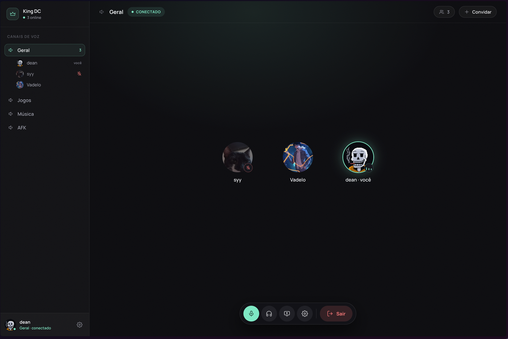

<h1 align="center">King DC</h1>

<p align="center">
  Voice and screen sharing for your group, on a server that is yours.
</p>

<p align="center">
  <a href="LICENSE"></a>
  
  
  
  
</p>

<p align="center">
  <a href="README.md">Português</a> · <b>English</b>
</p>

<p align="center">
  
</p>

King DC is a minimal Discord for a small group of up to about 20 friends or coworkers. It has voice channels, screen sharing, a profile with nickname and photo, and invites by code. It has no text chat, no camera and no history, and that is on purpose. It runs on a cheap VPS with one `.env` and one `docker compose up`.

## Why it exists

In August 2026, Discord blocked screen sharing and camera for users in Brazil, citing regulatory requirements. Overnight, part of our group lost the feature they used most: showing their screen to the others while playing or working.

The workaround was a VPN. It works, but the price is lag: voice arrives late, the game stutters, and a call that was supposed to be casual turns into a negotiation over who has the better ping. For a group spread across different countries, that does not hold up.

King DC is the simple answer. Few features, each of them complete, running on a server you pick yourself, close to where the group is. No middleman deciding what can or cannot be shared. What was left out was left out by decision, not for lack of time.

## What it does and what it doesn't

<table>
<tr>
<th align="left" width="50%">Does</th>
<th align="left" width="50%">Doesn't, on purpose</th>
</tr>
<tr>
<td valign="top">

- Voice channels. The seed creates Geral, Jogos, Música and AFK; the admin creates more.
- Screen sharing with audio, fixed at 720p 30 fps.
- Mute, deafen, push-to-talk or voice activity detection.
- Indicators for who is speaking, who is muted and who is sharing.
- Who is in which channel, in the sidebar, refreshed every 2 s.
- Profile with nickname and photo. The photo becomes a 256 px WebP on the server.
- Invite by 6-character code, valid for 7 days. The code is the login.
- Microphone and output device selection, mic test and master output volume.
- Automatic TLS, migrations on boot, backup script.

</td>
<td valign="top">

- Text chat, direct messages or history of any kind.
- Camera.
- Call recording.
- Login with Google or Discord, e-mail, password recovery. Lost your password? The admin issues a new invite.
- Mobile interface. The layout is desktop-only, with a 1280 px minimum width. On a phone, joining a call, talking and watching someone's screen works; sharing your own screen does not.
- Multiple servers or roles beyond admin.
- Per-participant volume (on the roadmap).
- Light theme or other languages. The interface is Portuguese only and dark only.

</td>
</tr>
</table>

## How it works

<p align="center">
  
</p>

**Caddy** takes everything that arrives over HTTPS, issues the certificate on its own and forwards to the front end or to LiveKit signaling. **web** is the Next.js app that serves the interface and rewrites `/api` calls to the internal API, so the browser only knows one origin and there is no CORS. The **API** handles login, profile, invites, channels and presence, and signs the token that grants access to a room. **LiveKit** is the media server: it receives each person's audio and screen once and forwards them to the others, without transcoding. **Postgres** stores users, invites, sessions and channels. Presence never touches the database.

Media does not go through the proxy because WebRTC travels over UDP, on per-connection ports, and forcing it through a TCP proxy only adds delay. That is why LiveKit runs on the host network and the browser talks to it directly.

The full path of a call, the data model, the HTTP API and the numbered decisions the code refers to are in [`docs/ARQUITETURA.md`](docs/ARQUITETURA.md) (Portuguese).

## Running on a VPS

Five steps for a clean Ubuntu VPS. The full walkthrough, with firewall, every `.env` variable explained, backup and updates, is in [`docs/SETUP.md`](docs/SETUP.md) (Portuguese). If the VPS is on Vultr, [`infra/vultr-cloud-init.md`](infra/vultr-cloud-init.md) has a cloud-init that does steps 2 and 3 for you.

**1. DNS.** Create two A records pointing to `<vps-ip>` before bringing the stack up, otherwise Caddy cannot issue the certificate:

```
kingdc.your-domain.com   →  <vps-ip>
lk.your-domain.com       →  <vps-ip>
```

**2. Docker and firewall.** Use the cloud-init above or do it by hand:

```sh
curl -fsSL https://get.docker.com | sudo sh
sudo usermod -aG docker "$USER"
```

Open ports 80 and 443 (TCP), 7881 (TCP), 3478 (UDP) and 50000 to 60000 (UDP). The full list and the rule for internal port 7880 are in [`docs/SETUP.md`](docs/SETUP.md#3-firewall).

**3. Code.**

```sh
sudo git clone https://github.com/deandevz/king-dc.git /opt/kingdc && sudo chown -R "$USER" /opt/kingdc
cd /opt/kingdc
```

**4. Configuration.**

```sh
cp .env.example .env && chmod 600 .env
```

Fill in the two domains, generate the secrets with `openssl rand -base64 32`, create a fresh LiveKit key pair and choose the first admin's code and password. Every variable is explained inside `.env.example`.

**5. Up.**

```sh
docker compose -f docker-compose.yml --profile prod up -d --build
curl -s https://kingdc.your-domain.com/api/health    # {"ok":true,"db":true,"livekit":true}
```

Open `https://kingdc.your-domain.com`, sign in with the admin code and password, pick a nickname and a photo, and issue invites from the "Convidar" button.

## How much it handles

In a room of N people, each one sends one audio stream and receives N−1, so the server moves **N × (N−1)** streams. One room of 20 is 380 streams; the same 20 people in 4 rooms of 5 is 80, almost 5 times less. Voice is cheap. Screen sharing is what costs, and there the limit is the bandwidth allowance, not the CPU.

**This is an assumption, not a measurement.** The numbers come from the [official LiveKit benchmark](https://docs.livekit.io/transport/self-hosting/benchmark/) extrapolated to small machines, with guesses about how many people stay silent and how many members are in voice at peak. The right thing is to measure real usage with `docker stats` and the provider's traffic graph during a full call. If you run King DC with a bigger group and have numbers, **open an issue**: that is what this page is missing.

| VPS | Price/month | In call, normal use | Community it fits | Screen: viewer h/day |
|---|---|---|---|---|
| Vultr 1 vCPU / 2 GB / 3 TB, São Paulo (reference deployment) | ~US$ 18 (US$ 8 outside SP) | ~80 people | ~400 members | ~120 |
| Hetzner 2 vCPU / 4 GB / 20 TB, US or Europe | ~€ 8 | ~160 people | ~800 members | ~800 |
| Vultr 4 vCPU / 8 GB / 6 TB, São Paulo | ~US$ 72 | ~325 people | ~1,600 members | ~240 |

In normal use, even the US$ 6 VPS handles about 80 people in voice-only calls. Screen sharing is what separates the machines: the € 8 Hetzner allows 40 five-viewer streams per day; the reference box allows 6. Outside Brazil, latency rises by 120 to 150 ms.

Full table with 11 machines, calculation rules, what gives out first and the assumptions that may be wrong: [`docs/CAPACITY.md`](docs/CAPACITY.md).

## Local development

In development, media goes to a free [LiveKit Cloud](https://cloud.livekit.io) project, because `livekit-server` in host network mode does not run on Docker Desktop for Mac or Windows. Only Postgres, the API and web run in containers.

```sh
cp .env.example .env         # LiveKit Cloud keys + secrets
pnpm install
docker compose up -d --build # api on :3000, web on :3001
```

Or run the API and web outside containers with `pnpm dev:api` and `pnpm dev:web`, with only Postgres in Docker.

```sh
pnpm typecheck && pnpm lint
pnpm test                                  # api: vitest + ephemeral Postgres via testcontainers; web: vitest
E2E_PORT=4567 pnpm --filter web test:e2e   # next build + Playwright against an API mock
```

The e2e suite starts the standalone Next build on `E2E_PORT` and an API mock on `MOCK_PORT` (default 3900). Tests tagged `@livekit` open two browsers in a real room of the project configured in `.env`; without the keys they are skipped. There is also a script against the full stack with `QA_REAL=1`. All of that, plus the Prisma, Playwright and Alpine pitfalls, is in [`docs/SETUP.md`](docs/SETUP.md#testes) (Portuguese).

## Stack

| Part | Choice |
|---|---|
| Front end | Next.js 16 (App Router), React 19, CSS Modules, SWR |
| API | Fastify 5, Prisma 7, Zod 4, argon2 |
| Database | Postgres 18 |
| Media | LiveKit server 1.13 self-hosted, `livekit-client`, `@livekit/components-react` (hooks only, no prebuilt components) |
| Edge | Caddy 2 with automatic TLS |
| Monorepo | pnpm workspaces, strict TypeScript, ESM everywhere |
| Tests | vitest + testcontainers on the API; vitest + Playwright on the front end |

```
apps/api            Fastify + Prisma
apps/web            Next.js
packages/contracts  Zod schemas and types shared between api and web
infra               livekit.yaml, Caddyfile, backup.sh, cloud-init
design              HTML mockups of every screen
docs                setup, architecture, interface and capacity
```

## Design decisions

- **The invite code is the login.** First use with a new password creates the account; after that, code plus password signs you in. No e-mail, no username.
- **There is no membership table.** It is a single server, and everyone sees every channel. One less table, one less screen.
- **Presence comes from LiveKit.** The API asks who is in each room, caches it for 2 s and serves the old value while refreshing in the background. The LiveKit webhook evicts the channel that changed. None of it goes to the database.
- **Deafen is client-side.** LiveKit has no such concept, so the front end zeroes everyone's volume and mutes the microphone. Nobody else is told.
- **Screen is fixed at 720p30.** It is the SDK's official preset. Sixty frames would cost 1.5 times the bandwidth for an improvement that does not matter on a shared screen, and bandwidth is the bill that arrives.
- **The room token is signed locally.** The API does not ask LiveKit before granting access; if LiveKit goes down, people already in the call stay, and anyone trying to join finds out immediately.
- **Audio preferences live in the browser.** Device, volume, microphone mode and push-to-talk key sit in `localStorage`. Not worth an endpoint.
- **No secret reaches the bundle.** The front end gets the LiveKit URL along with the token, not from a public environment variable.

All 24 decisions, each with its reason, are in [`docs/ARQUITETURA.md`](docs/ARQUITETURA.md#3-decisões-de-projeto) (Portuguese).

## Known limits

- **F5 in the middle of a call returns you to the waiting room.** State lives in the tab; reloading disconnects and there is no automatic rejoin.
- **Push-to-talk only works with the tab focused.** There is no global keyboard shortcut on a web page.
- **The same account in two tabs in the same room kicks the first one.** LiveKit accepts one identity per room.
- **Other channels lag up to 2 s.** The channel you are in is real time, straight from the room. To keep the others at that pace in production, enable the webhook in `infra/livekit.yaml`.
- **An API outage does not drop the call.** The sidebar freezes with a warning and recovers on its own when the API is back.
- **Screen sharing does not work on phones.** That is a browser limit, not King DC's: Safari and Chrome on mobile do not expose `getDisplayMedia`. Watching someone's screen and talking works.
- **Microphone "allowed" on the site but silent, on macOS.** The system asks permission per app; enable the browser under System Settings, Privacy & Security, Microphone.

The full list, with symptoms and fixes, is in [`docs/SETUP.md`](docs/SETUP.md#comportamentos-conhecidos) (Portuguese).

## Roadmap

Short and with no dates promised.

- Replace the 2 s polling with SSE, so other channels' presence arrives instantly and the API handles more people online.
- Per-participant volume.
- Optional text chat, off by default, without long history.
- Port the interface to mobile with a responsive layout. Voice and watching a screen already work in a phone browser today; the UI needs to catch up.

## Contributing

Issues and pull requests are welcome. The rules are in [`CONTRIBUTING.md`](CONTRIBUTING.md) (Portuguese): a bug or feature starts with an issue, one PR solves one thing, short description written by you. Before opening a PR, run the gate:

```sh
pnpm typecheck && pnpm lint && pnpm --filter api test && pnpm --filter web test \
  && E2E_PORT=4567 pnpm --filter web test:e2e
```

Rules the code follows and a PR must follow too: strict TypeScript with no `any`, files up to 300 lines, every API route with an integration test, UI strings in Portuguese and identifiers in English. What is out of scope is listed in [`docs/ARQUITETURA.md`](docs/ARQUITETURA.md#3-decisões-de-projeto); a new feature that touches it starts with an issue, not with code.

## License

[MIT](LICENSE).
