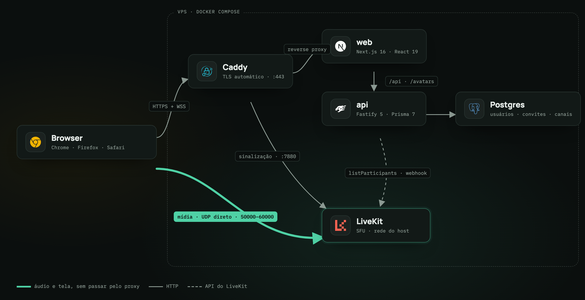

# Arquitetura

Como o King DC funciona por dentro: as peças, o caminho de uma call, as decisões que moldaram
o código, o modelo de dados, a API e o módulo de call do front. Para subir e operar, veja
[`SETUP.md`](SETUP.md). Para o sistema visual, [`INTERFACE.md`](INTERFACE.md).

## 1. Peças

<p align="center">
  
</p>

| Peça | O que faz | Onde vive |
|---|---|---|
| **Caddy** | Recebe tudo que chega por HTTPS, emite e renova o certificado sozinho, repassa para o `web` ou para a sinalização do LiveKit. | `infra/Caddyfile` |
| **web** | Next.js que serve a interface. Reescreve `/api/*` e `/avatars/*` para a API interna, então o browser conhece uma origem só e não existe CORS. | `apps/web` |
| **API** | Fastify. Login, sessão, perfil, convites, canais, presença e a assinatura do token que dá acesso a uma sala. | `apps/api` |
| **LiveKit** | Servidor de mídia (SFU). Recebe o áudio e a tela de cada pessoa uma vez e reenvia para as outras, sem recodificar. | `livekit/livekit-server`, config em `infra/livekit.yaml` |
| **Postgres** | Usuários, convites, sessões e canais. Presença não vai para o banco. | volume `pgdata` |
| **contracts** | Schemas Zod e tipos compartilhados entre `api` e `web`. É a única definição dos shapes da API. | `packages/contracts` |

A mídia não passa pelo Caddy. WebRTC anda por UDP, em portas próprias por conexão, e forçar
isso por um proxy TCP só adiciona atraso. Por isso o LiveKit roda com a rede do host
(`network_mode: host`) e o browser fala direto com ele. Os outros serviços ficam numa rede
bridge normal e alcançam o LiveKit pelo gateway do Docker (`host.docker.internal:7880`).

## 2. O caminho de uma call

1. **Login.** O usuário digita um código de 6 caracteres e uma senha. Se o código é de um
   usuário, a API confere a senha. Se é um convite válido e não usado, cria a conta na hora.
   A resposta grava o cookie de sessão `kingdc.sid`.
2. **Onboarding.** Conta sem apelido cai em `/onboarding`. Nick e foto vão para a API; a foto
   vira WebP de 256 px no disco.
3. **Tela principal.** O front chama `GET /channels` a cada 2 s. A API pergunta ao LiveKit
   quem está em cada sala, guarda por 2 s e responde.
4. **Entrar num canal.** O front chama `POST /channels/:slug/token`. A API assina um JWT do
   LiveKit localmente, sem consultar o servidor de mídia, com `identity = user.id`,
   `room = slug` e `metadata = { nickname, avatarUrl }`. Devolve o token e a URL do LiveKit.
5. **Sala.** O browser conecta no LiveKit com o token. A sala nasce no primeiro join; ninguém
   a pré-cria. Nick e foto dos outros vêm do `metadata` de cada participante, sem consulta
   extra à API.
6. **Presença em tempo real.** Enquanto conectado, a lista do canal atual vem da própria sala
   (entrou, saiu, mutou, compartilhou). Os outros canais continuam vindo do polling.
7. **Renovação.** O token vale 6 h e o front pede outro a cada 5 h. Token vencido não derruba
   quem já está conectado, só impede uma reconexão. Renovar antes evita isso.
8. **Webhook (opcional em produção).** O LiveKit avisa a API quando alguém entra ou sai. A API
   apaga a entrada daquele canal no cache, e o polling seguinte busca fresco.

## 3. Decisões de projeto

Os comentários no código citam estas decisões pelo número (`decisão D5`). Mexer numa delas
começa por atualizar esta tabela.

| # | Tema | Decisão | Por quê |
|---|---|---|---|
| D1 | Login | O código de convite é o login permanente. Primeiro uso com senha nova cria a conta; depois, código e senha autenticam. | A tela de login só tem código e senha. Elimina e-mail e nome de usuário. |
| D2 | Código | 6 caracteres maiúsculos do alfabeto `ABCDEFGHJKLMNPQRSTUVWXYZ23456789` (sem 0, O, 1, I). | 32^6 dá mais de 1 bilhão de combinações. Com rate limit, sobra para 20 contas. |
| D3 | Membros | Não existe tabela de membros. Um servidor só; todo mundo vê todos os canais. | Menos uma tabela, menos uma tela. |
| D4 | Admin | Coluna `isAdmin`. Só admin cria convite e canal. O seed cria o primeiro admin. | Convite precisa de dono. Vinte pessoas não justificam cargos. |
| D5 | Presença | Fonte de verdade é o `listParticipants` do LiveKit, agregado pela API com cache de 2 s. O webhook apaga a entrada do canal que mudou. O front faz polling a cada 2 s; no canal conectado, a lista vem da sala. | O webhook do LiveKit não tem garantia de entrega. SSE ou WebSocket é custo sem retorno para 20 pessoas. |
| D6 | Token | TTL de 6 h, renovado pelo front a cada 5 h. `canPublishSources` = microfone, tela e áudio da tela. `metadata` = JSON com nick e foto. `identity` = id do usuário. | Expiração não derruba conexão ativa, só reconexão. Sem câmera. |
| D7 | Sala | `room = channel.slug`. Nasce no primeiro join, sem `createRoom`. | O canal já existe no Postgres. Criar a sala antes é trabalho extra. |
| D8 | Tela | 1280×720 a 30 fps, 2 Mbps, `contentHint: 'detail'`, com áudio. Simulcast ligado. Sem seletor de qualidade. | É o preset oficial do SDK. 60 fps custaria 1,5 vez mais banda para uma melhora que não importa em tela compartilhada. |
| D9 | Ensurdecer | No cliente: volume zero em todo remoto e microfone mutado. Ensurdecer implica mutar; desensurdecer não desmuta. | O LiveKit não tem esse conceito. Semântica igual à do Discord. |
| D10 | Preferências de áudio | Só no `localStorage`, chave `kingdc.audio`: dispositivo de entrada e saída, volume de saída, modo do microfone e tecla do push-to-talk. | IDs de dispositivo são por browser. Não vale um endpoint. |
| D11 | Volume do microfone | Não existe slider de ganho de entrada. Só volume de saída. | Ganho de entrada exigiria Web Audio no caminho da track. O `autoGainControl` do browser já cobre. |
| D12 | Push-to-talk | Tecla padrão `Backquote`. Segurar liga o microfone, soltar desliga. Só com a aba em foco. | Não existe atalho global de teclado numa página web. A UI avisa. |
| D13 | Avatar | PNG, JPG ou WebP até 5 MB, validado por decodificação real, salvo como WebP 256×256 em `/data/avatars/<userId>.webp`. URL com `?v=<epoch>`. Sem foto: gradiente e inicial, índice = hash do id mod 7. | O `?v=` quebra o cache ao trocar a foto. |
| D14 | Apelido | 2 a 24 unidades UTF-16, sem caracteres de controle ou formatação (zero-width, RTL override), ao menos um visível. Não precisa ser único. | O contador da UI é "5 / 24" e usa `String.length`. Front e API concordam. |
| D15 | Sessão | Cookie `kingdc.sid`, httpOnly, `SameSite=Lax`, `Secure` em produção, 30 dias deslizantes, guardado no Postgres. | Sem JWT de sessão: revogar é apagar a linha. |
| D16 | Front e API | O Next reescreve `/api/:path*` e `/avatars/:path*` para `API_INTERNAL_URL`. O browser só conhece a origem do `web`. | Sem CORS, sem cookie cross-site. |
| D17 | Canais | O seed cria `geral`, `jogos`, `musica` e `afk`. Admin cria mais. Sem editar ou apagar. `slug` é kebab-case único; `name` tem 1 a 32 caracteres visíveis. | |
| D18 | Sair | Sair da conta pede confirmação. Sair da call, não. | |
| D19 | Largura | Mínimo 1280 px. Abaixo disso, scroll horizontal. | Layout de desktop. |
| D20 | Estados | Loading, erro, vazio, reconectando e "clique para ativar áudio" usam os tokens do sistema. Um toast só, no canto inferior direito, para erro de rede. | |
| D21 | Convidar | O botão só aparece para admin. Abre um modal que chama `POST /invites` e mostra o código com botão de copiar. | |
| D22 | Monorepo | pnpm workspaces, sem Turborepo. ESM em tudo. Node 24 nas imagens Docker, 22 ou mais novo na máquina. | |
| D23 | Versões | Next 16, React 19, Fastify 5, Prisma 7 (não a 8 release candidate), `livekit-server-sdk` 2.18, `livekit-client` 2.22, `@livekit/components-react` 2.9, Zod 4, vitest 4. | Combinação verificada pelas `peerDependencies` de cada pacote. |
| D24 | Compose | Um `docker-compose.yml`. `livekit` e `caddy` no profile `prod`. O `docker-compose.override.yml` só publica portas para desenvolvimento. | Profile é topologia (sobe ou não). Override é valor (porta, env). |
| D25 | Sons | Oito MP3 de nome fixo em `apps/web/public/sounds/`: `mutar`, `desmutar`, `mute-fone`, `desmute-fone` (só quem clicou ouve) e `entrou`, `saiu`, `tela-inicio`, `tela-fim` (todo mundo na mesma sala, pelos eventos da sala). Push-to-talk não toca. Saem no dispositivo e volume de saída das preferências, mesmo ensurdecido. Trocar o som é trocar o arquivo. | Feedback igual ao do Discord. Quem entra numa sala cheia, com tela aberta, ouve só o próprio "entrou": o SDK só emite `ParticipantConnected` e `TrackPublished` depois de conectado. Quem sai compartilhando gera só "saiu". |

Fora do escopo, de propósito: chat de texto, mensagens diretas, histórico, OAuth, câmera,
gravação, celular, editar ou apagar canal, volume por participante, cargos além de admin,
e-mail, recuperação de senha (o admin gera um convite novo), notificações, tema claro, outros
idiomas.

## 4. Modelo de dados

O schema real está em `apps/api/prisma/schema.prisma`. Quatro tabelas.

```prisma
model User {
  id              String    @id @default(cuid())
  code            String    @unique      // código de convite = login
  nickname        String?                // null até o onboarding
  avatarUpdatedAt DateTime?              // null = sem foto
  passwordHash    String                 // argon2id
  isAdmin         Boolean   @default(false)
  createdAt       DateTime  @default(now())
}

model Invite {
  code        String    @id              // 6 caracteres
  createdById String
  createdAt   DateTime  @default(now())
  expiresAt   DateTime                   // createdAt + 7 dias
  usedAt      DateTime?
}

model Session {
  id        String   @id                 // 32 bytes aleatórios, base64url
  userId    String
  expiresAt DateTime
  createdAt DateTime @default(now())
}

model Channel {
  id        String   @id @default(cuid())
  slug      String   @unique
  name      String
  position  Int      @default(0)
  createdAt DateTime @default(now())
}
```

**Consumir um convite é atômico.** Numa transação, `UPDATE "Invite" SET "usedAt" = now()
WHERE code = $1 AND "usedAt" IS NULL AND "expiresAt" > now()` precisa afetar uma linha.
Se não afetar, é 401. Só então o usuário é inserido com o mesmo código. O convite fica como
registro histórico.

**Migrações rodam no boot.** O entrypoint da API aplica `apps/api/prisma/migrations` com um
runner próprio, compatível com a tabela `_prisma_migrations`, sem o CLI do Prisma na imagem.
Se a migração falhar, o container sai e o Docker o religa em loop. Migração nova é criada em
desenvolvimento com `pnpm --filter api prisma:migrate`.

**Seed idempotente.** Com `SEED_ADMIN_CODE` e `SEED_ADMIN_PASSWORD` definidos, o boot faz
`upsert` do admin (e converge a senha para a do `.env`) e dos quatro canais iniciais.

## 5. API HTTP

Base pública: `/api` (via rewrite do Next). A API em si escuta na raiz, porta 3000.
Todo erro tem o formato `{ error: { code, message } }` com status semântico. Os códigos:
`INVALID_CREDENTIALS`, `INVITE_EXPIRED`, `VALIDATION`, `UNAUTHENTICATED`, `FORBIDDEN`,
`NOT_FOUND`, `RATE_LIMITED`, `AVATAR_INVALID`, `AVATAR_TOO_LARGE`, `LIVEKIT_UNAVAILABLE`,
`INTERNAL`.

Tudo exige cookie de sessão, exceto `/auth/login`, `/auth/logout`, `/health`,
`/webhooks/livekit` e `/avatars/*`. Sem cookie: 401 `UNAUTHENTICATED`. Rota de admin sem ser
admin: 403 `FORBIDDEN`.

### Auth

| Método | Rota | Body | 200 | Erros |
|---|---|---|---|---|
| POST | `/auth/login` | `{ code: string(6), password: string(8..128) }` | `{ user: Me }` e `Set-Cookie` | 401 `INVALID_CREDENTIALS`, 401 `INVITE_EXPIRED`, 429 `RATE_LIMITED` |
| POST | `/auth/logout` | — | `{ ok: true }` e cookie limpo | Nenhum. Sem cookie ou sessão já apagada também é 200. |

O login responde a mesma mensagem para código inexistente e senha errada, e gasta o mesmo
tempo nos dois casos (verifica um hash falso quando o usuário não existe). Limite de 10
tentativas por minuto por IP.

### Perfil

| Método | Rota | Body | 200 |
|---|---|---|---|
| GET | `/me` | — | `Me` |
| PATCH | `/me` | `{ nickname: string(2..24) }` | `Me` |
| PUT | `/me/avatar` | multipart, campo `file` | `Me` |
| DELETE | `/me/avatar` | — | `Me` |

```ts
type Me = {
  id: string;
  code: string;
  nickname: string | null;   // null manda o front para /onboarding
  avatarUrl: string | null;  // "/avatars/<id>.webp?v=<epoch>" ou null
  isAdmin: boolean;
};
```

### Canais e presença

| Método | Rota | Body | 200 |
|---|---|---|---|
| GET | `/channels` | — | `{ channels: ChannelWithPresence[], onlineCount: number }` |
| POST | `/channels` (admin) | `{ name: string(1..32) }` | `Channel` |
| POST | `/channels/:slug/token` | — | `{ token: string, url: string, expiresAt: string }` |

```ts
type Channel = { id: string; slug: string; name: string; position: number };
type PresenceParticipant = {
  userId: string; nickname: string; avatarUrl: string | null;
  micMuted: boolean; screenSharing: boolean;
};
type ChannelWithPresence = Channel & { participants: PresenceParticipant[] };
```

- `onlineCount` é o número de usuários distintos somando todos os canais.
- `micMuted` é track de microfone ausente ou mutada. `screenSharing` é track de tela presente.
- Sala inexistente no LiveKit é lista vazia, não erro.
- O cache de presença é *stale-while-revalidate*. Com entrada vencida, a API responde na hora
  com o valor antigo e atualiza por trás, uma atualização por canal, sem empilhar. Só bloqueia
  quando não há cache nenhum.
- Se o LiveKit não responder em 3 s, ou se a última atualização em background falhou, a
  resposta leva o header `X-Presence-Stale: 1`. O front mostra "Presença pode estar
  desatualizada".
- `POST .../token` só assina um JWT local. Devolve 503 `LIVEKIT_UNAVAILABLE` apenas se a
  assinatura falhar (chaves ausentes ou inválidas). LiveKit fora do ar é descoberto pelo
  front ao conectar.

### Convites (admin)

| Método | Rota | 200 |
|---|---|---|
| POST | `/invites` | `{ code: string, expiresAt: string }` |
| GET | `/invites` | `{ invites: { code, createdAt, expiresAt, usedAt }[] }` |

### Infra

| Método | Rota | Nota |
|---|---|---|
| GET | `/health` | `{ ok: true, db: boolean, livekit: boolean }`. Sempre 200 enquanto o processo vive. Usado no healthcheck do compose. |
| POST | `/webhooks/livekit` | Corpo bruto e header `Authorization`, validados com o `WebhookReceiver` do SDK. Apaga do cache o canal do evento. 401 se a assinatura for inválida. |
| GET | `/avatars/:file` | Estático do volume. `Cache-Control: public, max-age=31536000, immutable`. |

## 6. Variáveis de ambiente

| Nome | Serviço | Nota |
|---|---|---|
| `DATABASE_URL` | api | Dentro do compose o host é `postgres`. |
| `SESSION_SECRET` | api | 32 bytes ou mais. Assina o cookie. |
| `LIVEKIT_URL` | api | URL `wss://` pública. Devolvida ao front pelo endpoint de token. |
| `LIVEKIT_API_KEY`, `LIVEKIT_API_SECRET` | api, livekit | Nunca chegam ao `web`. |
| `LIVEKIT_HOST_HTTP` | api | Base HTTP do `RoomServiceClient`. Em produção, `http://host.docker.internal:7880`. |
| `AVATAR_DIR` | api | Volume `/data/avatars`. |
| `SEED_ADMIN_CODE`, `SEED_ADMIN_PASSWORD` | api | Só o seed lê. |
| `API_INTERNAL_URL` | web | Alvo do rewrite. No compose, `http://api:3000`. |
| `PUBLIC_DOMAIN`, `LIVEKIT_DOMAIN` | caddy | Os dois domínios com registro A. |
| `POSTGRES_PASSWORD` | postgres, api | |

Nenhuma variável `NEXT_PUBLIC_*` carrega segredo. O Next embute essas variáveis no bundle que
o browser baixa. O front recebe a URL do LiveKit junto com o token, não por env.

## 7. Front

### Rotas

| Rota | Conteúdo |
|---|---|
| `/login` | Código e senha. Já logado vai para `/app`. |
| `/onboarding` | Nick e foto. Só para quem tem `nickname: null`. |
| `/app` | Duas colunas. Sidebar e "escolha um canal". |
| `/app/c/[slug]` | Sala de espera ou call, na mesma página. Entrar e sair trocam o estado, não a rota. |
| `/app?settings=1` | Configurações são um modal controlado por search param. ESC fecha. |

O middleware manda para `/login` quem não tem cookie. Todas as páginas de `/app` são Client
Components e buscam dados com SWR em `/api/...`.

### Módulos

```
apps/web/src
  app/                rotas, só compõem módulos
  ui/                 primitivos: Button, Field, CodeInput, Avatar, Glass, Slider,
                      Segmented, Badge, Toast, Modal, Icon. Sem lógica de domínio.
  ui/tokens.css       variáveis CSS do sistema visual
  features/auth       login, logout, useMe
  features/profile    onboarding, upload de avatar, avatar sem foto
  features/channels   sidebar, lista de canais, presença, useChannels
  features/invites    modal de convite
  features/settings   modal de configurações, preferências de áudio, teste de mic
  features/shell      layout, contexto do app, toast
  call/               tudo que toca livekit-client e components-react
  lib/api.ts          fetch tipado com os schemas de packages/contracts
```

### O módulo `call/`

`CallRoom` é dono da conexão, da renovação do token, do `RoomAudioRenderer`, do aviso de
autoplay, dos tiles, do foco de tela compartilhada, da barra de controles, do push-to-talk e
do indicador de fala. Ele não sabe de rotas, cookies nem `fetch` além do `getToken` injetado.
A interface está em `packages/contracts/src/call.ts`:

```ts
type CallRoomProps = {
  channel: { slug: string; name: string };
  me: { id: string; nickname: string; avatarUrl: string | null };
  getToken: () => Promise<{ token: string; url: string; expiresAt: string }>;
  audioPrefs: AudioPrefs;
  onLeave: () => void;
  onConnectionChange: (s: 'connecting' | 'connected' | 'reconnecting' | 'disconnected') => void;
  onOpenSettings: () => void;
  onParticipantsChange?: (participants: PresenceParticipant[]) => void;
};
```

`onParticipantsChange` entrega a lista da sala no mesmo shape da presença da API, a cada
mudança. É o que deixa a sidebar do canal atual em tempo real enquanto os outros seguem no
polling.

Nenhum componente visual pronto do `@livekit/components-react` é usado (`ParticipantTile`,
`ControlBar`, `VideoConference`). O CSS deles é pensado para um layout tipo Meet, e o do King
DC é tipo Discord. Entram só os hooks (`useTracks`, `useTrackToggle`, `useMediaDeviceSelect`,
`useAudioPlayback`, `useParticipants`), o `LiveKitRoom` e o `RoomAudioRenderer`.

## 8. LiveKit na prática

**Portas.** A sinalização (7880, WebSocket) passa pelo Caddy e nunca é pública. A mídia vai
direto: UDP 50000 a 60000, TCP 7881 como fallback para quem não tem UDP livre (VPN, firewall
corporativo) e UDP 3478 para o TURN embutido. TURN/TLS na 443 é o plano B para redes que só
liberam 443, e exige tirar o Caddy dessa porta.

**TURN não é opcional.** Sem ele, quem está atrás de NAT restritivo ou VPN não fecha a
conexão de mídia. O `livekit-server` embute o próprio TURN, então não há coturn separado.

**Token inválido.** Quase sempre é relógio dessincronizado entre a API e o LiveKit (o claim
`nbf` fica no futuro), ou par de chaves de um ambiente usado no outro. Mantenha NTP nos hosts
e nunca reuse as chaves do LiveKit Cloud na VPS.

**Reconexão.** O SDK tenta primeiro retomar a sessão (ICE restart) e só depois abre uma nova.
A UI mostra "reconectando" nesse meio tempo. Duas abas com a mesma conta na mesma sala
disparam `DUPLICATE_IDENTITY`: o LiveKit aceita uma identidade por sala e a aba expulsa volta
para a sala de espera em vez de tentar reentrar.

**Autoplay.** O browser bloqueia áudio sem interação. O front checa `canPlayAudio` e mostra
"clique para ativar áudio" quando é falso. Sem isso, quem entra não ouve ninguém e não sabe
por quê.

**LiveKit Cloud em desenvolvimento.** O `livekit-server` em modo host não roda no Docker
Desktop do Mac ou Windows, então dev usa um projeto gratuito do Cloud. O plano gratuito tem
5.000 minutos por mês: cinco pessoas em call por 4 h ao dia gastam isso em quatro dias. Serve
para desenvolver, não para o grupo usar.

## 9. Detalhes que explicam o código

Coisas que parecem estranhas à primeira leitura e têm motivo.

**Login e sessão**

- O login com código inexistente verifica um hash falso de argon2. Código inexistente e senha
  errada respondem a mesma mensagem e demoram o mesmo tempo. Convite vencido responde na hora
  com `INVITE_EXPIRED`, porque já é um código distinto.
- Argon2id roda com 64 MiB, 3 passes e `parallelism: 1`. O custo de memória do
  `@node-rs/argon2` é por thread: 4 threads seriam 256 MiB por login numa VPS de 4 GB.
- A sessão de 30 dias só é estendida no banco quando a última renovação tem mais de 24 h.
  Evita uma escrita no Postgres a cada request.
- Sessões vencidas são apagadas a cada login, não por agendador.
- O rate limit confia no `X-Forwarded-For` só de proxy em loopback ou rede privada
  (`trustProxy: ['loopback', 'uniquelocal']`). Com `trustProxy: true`, mandar um header
  diferente a cada request furava o limite.
- O `errorResponseBuilder` do `@fastify/rate-limit` precisa devolver um `Error` com
  `statusCode`. Um objeto simples chegava no handler de erro como erro desconhecido e virava
  500 em vez de 429.
- Um `SEED_ADMIN_CODE` fora do alfabeto do convite deixa o admin sem conseguir logar: a API
  devolve 400 antes de olhar o banco e o campo de código do front nem aceita o caractere. O
  seed avisa em voz alta quando isso acontece.

**Presença**

- Sala inexistente no LiveKit é 404, e canal vazio é o estado normal. Sem traduzir 404 para
  lista vazia, todo `GET /channels` sem ninguém em call vinha com `X-Presence-Stale`.
- O `listParticipants` tem teto de 3 s. Com o host do LiveKit sumido, a rota travava 10 s no
  timeout de conexão; com um servidor que aceita e não responde, seriam 5 min.
- O cache é *stale-while-revalidate* porque o `listParticipants` do LiveKit Cloud custava 1,0
  a 1,4 s por chamada a partir do Brasil.
- O `livekit: true` do `/health` reporta configuração, não conexão. O healthcheck bate a cada
  10 s; consultar o LiveKit ali seriam 8.600 chamadas por dia. O `db` é uma query real.
- O `/health` tem `logLevel: 'silent'`. Antes, ele gerava 17 mil linhas de log por dia e, com
  o banco fora, um stack trace do Prisma a cada 10 s. Com rotação de 3 arquivos de 10 MB, um
  erro real sumia em poucos dias.
- O webhook exige corpo cru em `application/webhook+json`, com content type parser
  registrado na instância raiz do Fastify. JSON comum com JWT válido também dá 401.

**Call**

- Trocar a prop `token` do `LiveKitRoom` com a sala conectada não reconecta nem troca o token
  em uso. A renovação a cada 5 h importa no `onDisconnected` fora de saída deliberada: o token
  antigo pode ter vencido e a reconexão seria recusada. A API emite `iat` novo, a string muda
  e o `LiveKitRoom` reconecta.
- Quedas definitivas (`DUPLICATE_IDENTITY`, `PARTICIPANT_REMOVED`, `ROOM_DELETED`,
  `ROOM_CLOSED`) voltam para a sala de espera sem renovar token. Antes, a mesma conta em duas
  abas fazia cada aba renovar e reentrar, expulsando a outra para sempre.
- O `RoomAudioRenderer` recebe o volume já com o ensurdecer aplicado. Ele reaplica
  `setVolume` a cada track nova, o que desfaria o volume zero de quem entra durante o deaf.
- O foco de tela é escolhido por evento (`TrackPublished`), não por ordem guardada em estado.
  Guardar a ordem exigia `setState` dentro de `useEffect`, barrado pelo
  `eslint-plugin-react-hooks` 7.
- O dispositivo inicial de áudio vai em `RoomOptions`; a troca posterior usa
  `switchActiveDevice`. Mudar as opções recriaria a conexão a cada troca de microfone.
- O aviso "clique para ativar o áudio" só aparece em push-to-talk. Em detecção de voz o
  Chromium libera o autoplay para página que já captura microfone.
- Trocar de canal durante a call marca `connecting` na própria troca. Sem isso, entre o clique
  e a montagem da sala nova o badge dizia "Jogos · conectado" com a sala de Geral ainda no ar.
- `useScreenShare` engole `NotAllowedError` e `AbortError`. Cancelar o seletor de tela não é
  erro.
- Logs esperados do SDK no console, que não vazam para a UI: `error reading from signal
  stream … 1006` ao recarregar ou sair, `could not createOffer with closed peer connection` ao
  sair com tela ligada, `Tried to add a track for a participant, that's not present` uma vez ao
  reentrar depois do F5.

**Shell**

- Com erro no cache, o SWR pausa o `refreshInterval` e só revalida pelo retry de erro, que
  dobra o intervalo a cada falha. O retry é fixo em 2 s para o polling voltar quando a API
  reaparece.
- Com a API fora, o browser vê um 500 do rewrite do Next, não erro de rede.
- O `Modal` dependia de `onClose` no efeito de foco. Como o shell re-renderiza a cada poll e a
  arrow era nova a cada render, o foco pulava para o painel a cada 2 s.
- `useAudioPrefs` usa `useSyncExternalStore` sobre o `localStorage` para não divergir na
  hidratação.
- `enumerateDevices` sem permissão devolve rótulos vazios. A UI mostra "Microfone 1" até o
  primeiro `getUserMedia`.
- `lib/api.ts` passa toda resposta pelo `safeParse` do schema. Falha de rede e corpo fora do
  formato viram `INTERNAL` com mensagem pronta para a UI.
- `/dev-call` só existe fora de produção ou com `NEXT_PUBLIC_DEV_CALL=1`. Lê `url`, `token`,
  `nick` e `mode` da query e é o alvo do e2e com sala real.

**Avatar**

- O `sharp` roda com `limitInputPixels` de 40 milhões. O padrão (268 milhões) deixaria 5 MB
  de PNG virarem mais de 1 GB de bitmap.
- SVG e GIF são recusados de propósito. O `sharp` decodifica SVG, então ele passaria pela
  validação por decodificação.
- A gravação é em arquivo temporário seguido de `rename`. Uploads concorrentes do mesmo
  usuário nunca deixam arquivo pela metade.

**Infra**

- `API_INTERNAL_URL` é build arg da imagem do `web`. O destino dos `rewrites()` é resolvido
  no `next build`. Ler a env em runtime não tem efeito; ela só vale para `next dev`.
- `LIVEKIT_KEYS` vai por env no compose, não no `infra/livekit.yaml`, para o YAML ser
  versionável.
- O volume do Postgres monta em `/var/lib/postgresql`, não em `/var/lib/postgresql/data`. A
  imagem `postgres:18-alpine` recusa o caminho antigo.
- `docker compose stop api` não religa: parada pelo daemon conta como manual e
  `unless-stopped` respeita. Queda real do processo religa em 6 s.
- As migrações rodam sem o CLI do Prisma para a imagem da API cair de 964 MB para 445 MB. O
  CLI exige pacotes de studio e dev no require de topo e não dá para podar em partes. O
  `migrations.test.ts` roda `prisma migrate status` de verdade para pegar uma mudança na
  tabela `_prisma_migrations` antes do primeiro `up`.

## 10. Pendências conhecidas

- `POST /channels` calcula `position = max + 1` sem lock. Dois admins ao mesmo tempo podem
  empatar a posição. O `slug` continua único.
- Nome de canal duplicado responde 409 com código `VALIDATION`. Não existe código de conflito.
- Reconexão com token vencido não tem prova em runtime. A API não tem variável de TTL para
  teste; a cobertura é unitária, em `shouldRenewAfterDisconnect`.
- Em desenvolvimento via Docker, o socket da API é o gateway da bridge (rede privada), então
  o `X-Forwarded-For` continua aceito e o rate limit é contornável. Em produção o Caddy é o
  único proxy.
- Não existe indicador de "ensurdecido" para os outros. É local por decisão.
- O `AvatarPicker` cria o object URL num `useMemo` e revoga no efeito. Com `reactStrictMode`
  no `next dev`, a prévia pode quebrar depois do remount simulado. Produção não é afetada.
- O e2e com mock não cobre autoplay bloqueado. O Chromium sobe com autoplay liberado.
- A suíte de QA da infra rodou em macOS (arm64). Ela não cobriu `network_mode: host` de
  verdade, o Caddy emitindo TLS, a regra do `ufw` para a 7880, imagens amd64 nem
  `use_external_ip` sem NAT.

## 11. Regras de código

- TypeScript `strict`. Zero `any` fora de teste. Zero `@ts-ignore`.
- Arquivo até 300 linhas. Função até 60.
- Toda rota da API tem teste de integração com Postgres real (vitest e testcontainers).
  Todo fluxo crítico do front tem e2e no Playwright com mídia falsa.
- Strings de interface em português. Identificadores em inglês.
- Nunca commitar `.env`, `node_modules` ou `data/`.
